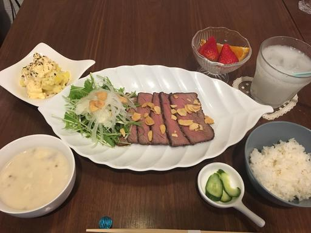

[TOC]

# はじめに 

どのような料理なのかイメージしやすいように、タブレットのメニューをご用意しました。参考になると嬉しいです。 

なお、クック酢のお料理は、芯付き、皮付きのことがあります。芯や皮の部分に栄養や甘味があるからです。 

それではごゆっくりお過ごしくださいませ。

# 旬のメニュー 

  
**小鮎の天ぷら**

* 新ごぼうと小エビのかきあげ・・・・・・・800円
* 小鮎の天ぷら・・・・・・・・・・・・・・800円
* 水なすと生ハムチーズのカルパッチョ・・・580円
* 焼きなす・・・・・・・・・・・・・・・・380円
* ハモ皮・・・・・・・・・・・・・・・・・350円

  
**ロールキャベツ**

今はレタスです。

  
**穴子天**

  
**ねぎバーグ・・・680 yen (ネギ感がアップしました)**  
クック酢のハンバーグの選びかた。  
デミグラ、焼きのどちらかを選びます。  
デミグラの場合は、プレーン\(600円\)かとろ〜りチーズ\(700円\)を選びます。\(とろ〜りチーズには、インカのめざめが付いてます。\)  
焼きの場合は、レンコン、ごぼう\(3〜4月は新物です\)、ねぎから選べます。\(上の写真はねぎの場合です\)  
ソースもお選びください。トマトか大根おろしを選べます。

鹿児島南国ポークの背脂をカリカリに炒めて乗せました。

# 新メニュー 

  
**コールドポーク・・・680 yen**

コールドポークというよりは蒸し豚。  
長ねぎ、お酒、しょうが等と茹でました。  
食べてください、コールドポーク。  
葱ダレでどうぞ。

コールドポークは馬路村のゆず香るサラダパスタ(900yen)にも使っています。
具だくさんオリーブオイルをのせて。

  
**明石焼風たまご焼き ・・・680 yen**  
焼きなすも付いてます。 

  
**ヤゲンなんこつとポテトフライ・・・580 yen**  
スタッフによると「まじヤバ」だそうです。 

  
フランスパンのフレンチトースト\(単品650yen/SET750yen\)だけでなく、ふわふわ食パンのフレンチトーストがメニューに加わりました。  
ココナッツオイルで焼いています。

  
**ふわふわのフレンチトースト・・・490 yen**   
撮影の都合3切れですが、実際には4切れです。 

  
**餃子\(6個\)・・・290 yen**  
オシャレな餃子を  
トリュフ塩 or 酢胡椒でどうぞ

  
**オープンオムレツ**  

* 新じゃがと厚切りベーコンのオープンオムレツ・・・680yen
* タコとオレガノのオープンオムレツ・・・・・・・・680yen
* 牛肉と新玉ねぎのオープンオムレツ・・・・・・・・680yen  
  ケチャップソースでどうぞ。
* トンテキのオープンオムレツ・・・・・・・・・・・900yen

**揚げ出し豆腐と揚げ出しおもち・・・650yen**  

**牛肉とレンコンのいため煮・・・680yen**  
上に乗っているのは、さつまいもで作った春雨です。  
胡麻油と唐辛子で炒めて、レンコン、牛肉と炒め煮しました。

少し甘めの味付けです。  
たっぷりの山芋をかけてお召し上がりくださいませ。

# 定番のばんごはん

おかずだけも選べます。 

  
**Aセット\(お刺身\)・・・1200 yen**

  
**Bセット\(ローストビーフ\)・・・1200 yen**

**Cセット・・・各1000yen**  
選べるようになりました\!  

# パフェ

* アイスに恋するお芋さんパフェ・・・680yen
* 宇治金時抹茶パフェ・・・・・・・・580yen
* キャラメルパフェ・・・・・・・・・580yen
* ミニチョコパフェ・・・・・・・・・350yen
* ミニいちごパフェ・・・・・・・・・450yen

お芋さんパフェはアイスが選べます。

# ソフトドリンク

## 酢ジュース、生ジュース

- 酢ジュース・・・・・・・410yen  
**酢フルーツ付き**  
果物と割り方をお選びください。  
果物はスタッフまで。  
ソーダ or 紅茶 or 牛乳 or カルピスで割ります。  
(カルピス割り考案者：スタッフあむちゃん)

- ゆず酢ジュース・・・・・380yen
- 生ジュース・・・・・・・580yen  
- いちごミルク（季節）・・480yen
- バナナジュース・・・・・450yen 

## コーヒー・紅茶

- ホットコーヒー・・・・・390yen
- アイスコーヒー・・・・・390yen
- エスプレッソ（Ｈｏｔ）・390yen
- 紅茶（Ｈｏｔ／Ｉｃｅ）・390yen  
  ストレート／ミルク／ゆず
- 抹茶オーレ・・・・・・・450yen
- ロイヤルミルクティー・・450yen
- キャラメルミルクティー・450yen
- ホットオーレ・・・・・・410yen
- アイスオーレ・・・・・・410yen
- ホッチョコ・・・・・・・450yen

<video controls>
  <source src="movie/tmrz-1518447087.webm" type="video/webm">
  <source src="movie/tmrz-1518447087.MP4" type="video/mp4">
</video>

## ジュース類

- カルピス・・・・・・・・270yen
- カルピスソーダ・・・・・270yen
- ジンジャエール・・・・・270yen
- コーラ・・・・・・・・・270yen
- 胡麻麦茶・・・・・・・・270yen
- ぶどうジュース・・・・・550yen  
  ワイン用のぶどうで作ったジュースです  
  赤/白

## フレーバーティー

- デコポンティー・・・・・450yen
- ジンジャーティー・・・・450yen
- マロンモンブランティー・450yen

# お酒

## ビール
お客様のご要望によりアサヒ、キリン、サントリーをご用意いたしました。  
ビールは冷たいうちに飲み切れるように小瓶です。  

- アサヒスーパードライ・・・・・・390yen  
- キリンラガー・・・・・・・・・・500yen  
- サントリープレミアムモルツ・・・500yen  
- サントリーオールフリー・・・・・470yen  
  ノンアルコール & プリン体ゼロ

## ハイボール・チューハイ・焼酎他

- ハイボール（ブラックニッカ）・・390yen
- ハイボール（オールドパー）・・・750yen
- ハイボール（ヘネシー）・・・・・800yen
- 酎ハイ・・・・・・・・・・・・・390yen  
  レモン、ライム、ゆず、カルピス、シークワーサー
- 焼酎（麦・芋）・・・・・・・・・390yen  
  ロック、水割り、ソーダ割り、お湯割りなど
- カシスソーダ・・・・・・・・・・390yen  
- カシスオレンジ・・・・・・・・・390yen  
- 梅酒・・・・・・・・・・・・・・390yen  
  ロック、ソーダなど
- ジントニック・・・・・・・・・・390yen  

## 日本酒
日本酒が好きなのでもっと置きたいのですが、
仕入れの都合上、やむなく３銘柄選びました。

- 八海山（新潟・純米吟醸）・・・・750yen  
  魚沼らしいスッキリとした味わい。
- 黒牛（和歌山・純米）・・・・・・650yen  
  お酒らしくもあり、甘味もあるので、個人的には一番好き。
- 山吹極（山形）・・・・・・・・・750yen  
  東北地方特有なのか、とてもフルーティーで飲みやすい。

## ワイン

- グラスワイン（赤・白）・・・450yen  
  赤：サンヴァンサン  
  白：サンヴァンサン
- ボトル・・・・・・・・・・・1900yen  
  赤：タクンレゼルヴァ カベルネソービニョン(チリ)  
  白：タクンレゼルヴァ シャルドネ(チリ)
- ハーフボトル・・・・・・・・2000yen  
  赤：ボッラバルボリチェッラクラシコ（イタリア）  
  白：ソアヴェクラシコ(イタリア）

その他スタッフまで。

## スコッチ
スコットランドのウイスキーです。  
ロック、水割り、ストレートなどで

- マッカラン１２年（スペイサイド）・・・900yen  
  スコッチの定番
- ボウモア１２年（アイラ）・・・・・・・900yen  
  あまりのスモーキーさにハマルかも？

## 果実酒

各450yen

- パイン
- イチゴ
- グレープフルーツ(生絞り果汁付き)
- ジンジャー
